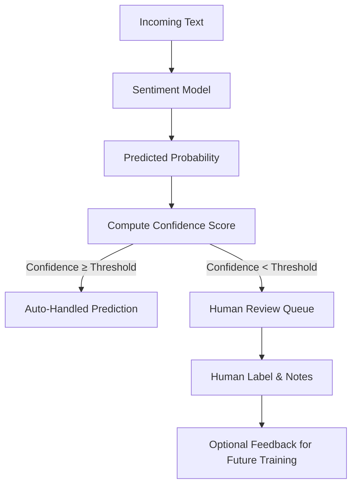

# Sentiment Classification with Human-in-the-Loop Review

Binary sentiment classification on the **GLUE SST-2** dataset using a feed-forward neural network, with **confidence thresholding** and a **human-in-the-loop (HITL) review workflow** to enable responsible automation.

---

## Overview

Organizations generate large volumes of unstructured text through reviews, surveys, support tickets, and internal communications. While this text contains valuable signals about satisfaction, risk, and emerging issues, it is rarely analyzed at scale due to time and resource constraints.

This project demonstrates how short text can be converted into **actionable sentiment signals** while explicitly accounting for **model uncertainty**. Rather than fully automating decisions, the system prioritizes human attention by routing ambiguous predictions to manual review.

Key goals:

* Build a lightweight, interpretable sentiment classifier
* Evaluate model behavior beyond aggregate accuracy
* Separate **model prediction** from **decision policy**
* Demonstrate confidence-based automation with human oversight

---

## Model Preview

Below are representative outputs from the trained model, illustrating how predictions and confidence scores are used in practice.

| Text                                                        | Predicted Sentiment | Confidence |
| ----------------------------------------------------------- | ------------------- | ---------- |
| “A smart, well-acted film that kept me engaged throughout.” | Positive            | 0.94       |
| “The plot was dull and the pacing painfully slow.”          | Negative            | 0.91       |
| “Not bad, but definitely not as good as the original.”      | Negative            | 0.72       |
| “An entertaining experience despite a few rough edges.”     | Positive            | 0.78       |
| “I wouldn’t recommend this to anyone.”                      | Negative            | 0.96       |

High-confidence predictions can be handled automatically, while lower-confidence predictions are flagged for human review.

---

## Dataset

* **Name:** GLUE SST-2 (Stanford Sentiment Treebank)
* **Task:** Binary sentiment classification (positive / negative)
* **Input:** Short movie review snippets
* **Source:** TensorFlow Datasets (TFDS)

SST-2 is a widely used benchmark for short-text sentiment analysis and is well suited for evaluating lightweight neural architectures.

---

## Modeling Approach

The model is a **feed-forward neural network** consisting of:

* an embedding layer,
* a pooling operation over token embeddings,
* fully connected layers,
* a sigmoid output for binary classification.

This architecture was chosen because it:

* performs well on short text,
* trains quickly,
* is easy to interpret,
* and is suitable for real-world deployment scenarios where simplicity and reliability matter.

Multiple architectural variants (pooling strategies, embedding sizes, regularization) were evaluated before selecting a final model.

---

## Confidence Thresholding & Human-in-the-Loop Review

Rather than forcing the model to label every input, predictions are handled differently based on **model confidence**.

### Confidence Definition

For each input sentence, the model outputs a probability of positive sentiment.
Confidence is defined as:

**Confidence = max(P(positive), 1 − P(positive))**

---

### Decision Policy

A configurable confidence threshold determines how predictions are handled:

* **Confidence ≥ threshold** → prediction is handled automatically
* **Confidence < threshold** → prediction is routed to human review

This ensures that automation is applied only where the model is most reliable.

---

### Human Review Queue

Predictions below the confidence threshold are placed in a review queue and prioritized by ambiguity (lowest confidence first). Reviewers assign the correct label and may optionally add notes explaining their decision.

This process:

* reduces the risk of incorrect automation,
* provides transparency and auditability,
* and creates high-quality labeled data for future model improvement.

---

## Automation Workflow



---

## Evaluation & Error Analysis

Model evaluation includes:

* test accuracy,
* confusion matrix analysis,
* qualitative inspection of misclassified examples.

Error analysis highlights common failure modes such as sarcasm, mixed sentiment, and subtle negation, reinforcing the importance of human oversight for ambiguous cases.

---

## Real-World Applications

This workflow mirrors how sentiment models are used in practice:

* **Product feedback monitoring:** detect spikes in negative sentiment after releases
* **Customer support triage:** route highly negative messages to senior agents
* **Brand sentiment tracking:** monitor trends while avoiding over-automation

In all cases, the model supports — rather than replaces — human judgment.

---

## Limitations & Future Work

**Limitations**

* Trained on movie reviews; domain shift may affect performance
* Binary sentiment only (no neutral or mixed class)
* Limited handling of sarcasm and nuanced language

**Future improvements**

* Domain-specific fine-tuning
* Neutral / mixed sentiment classes
* Active learning using human review feedback
* Cost-sensitive threshold selection

---

## Repository Structure

```
sentiment-ffnn-sst2/
  README.md
  notebook/
    sentiment_demo.ipynb
  outputs/
    figures/
    human_review_queue.csv
```

The notebook is structured as a narrative walkthrough combining EDA, modeling, evaluation, and operational design.

---

## License

This project is licensed under the **MIT License**.
